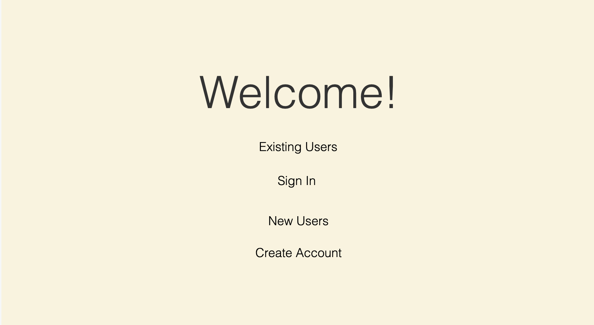
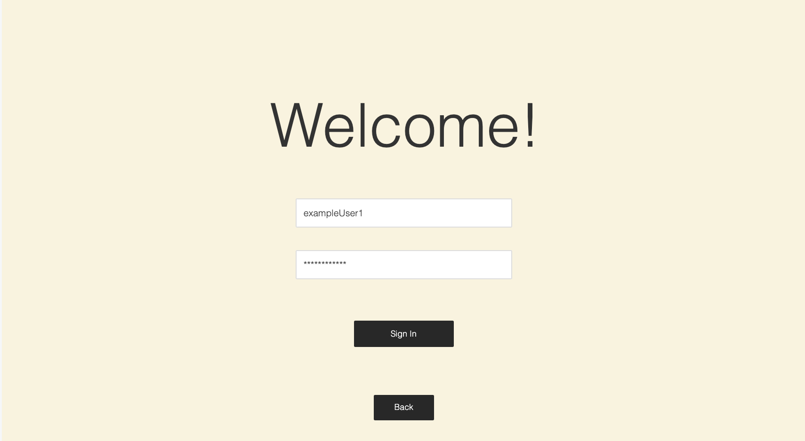
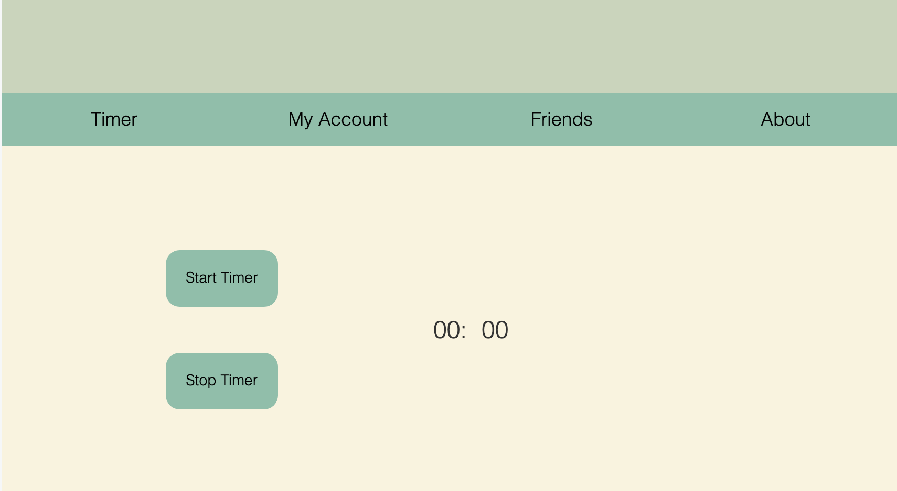
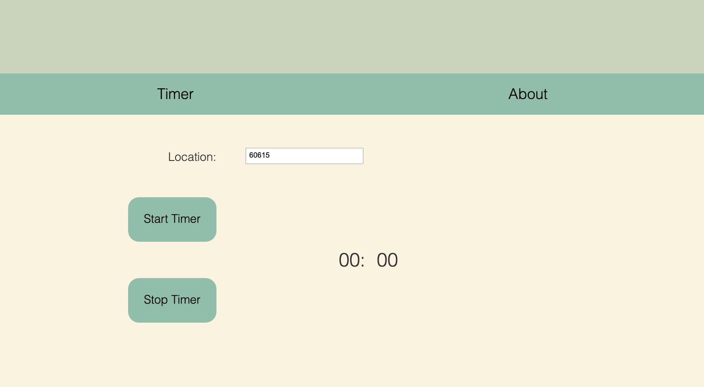

# Sprint-01 Report

## Team Number XX

List team members and roles here

Greg Prawdzik - IT Infrastructure

Julie Gelman - UI/UX & Security Reports

Ryan Crawford - Project Manager

Pradhyum Patel- Developer

## UI/UX Report

When designing our UX, we wanted to put the user first. So, we thought about how our concept of water saving could be best utilized by the user. We decided on a website because we wanted to incorporate a social aspect as well as multiple dynamic elements, such as the timer and location service. We felt these elements were best represented on a website, as opposed to a mobile app, so that they would be easier to change by the user. However, we also plan to make the site accessible on a mobile site, as it is intended to be used in the bathroom. We figured that the timer element would primarily be used on a mobile device, and the rest of the functions would be used primarily on a computer. We also wanted to closely follow HCI principles; by placing a back button and the exact same menu on each page, the user is easily able to backtrack their clicks, and the entire site remains consistent. Also, we decided to forego the use of a home screen for our website, as we believe it will be more convenient for the user to be directed right to the timer when they log on to the site. Additionally, in development, we will employ the use of status screens in the appropriate locations, such as when the user selects to show the visualization of their water use, so that the user is aware their click will be responded to. Further, the green color palette we settled on is representative of natural, earthly colors. This may also help users associate the use of the shower timer with having a positive effect on nature, as well as on their wallets. 

Consistency was also key in our UI design, which incorporates Brad Frost's atomic design methodology; keeping the same buttons, icons, colors, etc., across all pages enables us to build complex elements from simple building blocks. Additionally, our website will only refresh the entire page when necessary, to eliminate unnecessary buffering. For example, when the user navigates to their tracked water usage, and then selects to view the visualization, we can simply show the user a different view in the same area, without having to navigate to and load an entirely new page. We will also use tooltips where appropriate, and add some minimal animation to buttons on mouseover, so that the user knows their mouse is on a clickable area, and where the button will direct them.

## Developer Report

We have decided as a group to build a web application that is accessible by any device or computer. It's more convenient to build on one web app rather than building different application for different devices like ios or android. The three most important factors that a developer should keep in mind when making a application are Frontend, Backend, and Database. The developer's main responsibility is the Backend, where the coding occurs. There are many framework like Express, Django, and Ruby on Rails that can create web applications however our application backend is going to be done by the Spring Framework. The Spring Framwork is a programming model that uses java to create modern enterprise application- on any kind of deployment platform. Spring framework can also support any mulitple databases, and will be connected to Amazon's Mongodb database.

## IT Infrastructure Report

Being that this program would primarily be accessed by mobile devices, we looked at building a mobile application as mobile devices would primarily be used to access this program.  As we proceeded, we decided a website could serve this same purpose without worrying about writing different sets of code for different devices or writing code for just one subset of mobile users.  We have decided that the website will be hosted on a cloud provider.  This will help reduce cost while providing scalability.  We will have multiple front ends in front of a load balancer that will connect to a back end.  The data will be sent to the DynamoDB database.  

## Developer and Security Assumptions

In terms of site security, we will incorporate HTTPS protocol, so that users can be sure nothing will intercept what they see on the site. We may also incorporate an SSL certificate as well, ensuring users passwords and locations are secure. We will also limit front-end user permissions in order to limit potential damages should the site becomes compromised. To protect users' location, we may incorporate a form of Client Presence Verification, as a safeguard against users who may try to manipulate the location they appear in. Since we have decided to use Spring Framework for the backend, it comes with industry-standard authentication protocols like SAML, OAuth, and LDAP. 

## User/Admin/Anonymous Story Goes here

Initiative 1: Existing User Log In

As an existing site user, I want to log in so that I am able to use the shower timer. 

Screen 1: Website landing page.

Screen 2: Existing users may enter their username and password.

Screen 3: Upon login, the user is taken directly to the timer.

Acceptance criteria: Given valid login credentials, when an existing user clicks the "Sign In" button, they should be taken directly to the shower timer.

Initiative 2: Anonymous User Log in

As an anonymous guest user, I want to forego logging in so that I may use the shower timer. 

Screen 1: Website landing page.

Screen 2: By not choosing to sign in or create a new account, the guest user is only able to use the timer and read about the concept; they are not able to store and view their information.

Acceptance criteria: Given a valid zip code in the location box, the guest user will be able to use the "Start Timer" button.

Initiative 2: Customer Support

As an admin user, I want to log in so that I am able to view my inbox of customer messages.

Screen 1: Website landing page.

Screen 2: Admin user home page. Admin users are still able to use site functionality, however, instead of being taken directly to the timer upon login, they are taken directly to their customer support page.

Acceptance criteria: Given a login which is provisioned in the database to have admin access, when an admin user clicks the "Sign In" button, they are directed to their customer support page.

## Project Manager Report

Display the tasks and deadlines the Project Manager created and then display and discuss the actual completed percentages of tasks and describe the reasons for this percentage if necessary

Overall, the start to this project went well. This sprint we decided on the topic of our project: A webiste that allows users to track their water consumption in the shower compared to friends and the national average. The goal of this project is to help individuals learn how much water they are consuming. This could be good for people who live in areas facing drought, or need to cut down on a water bill. Our IT Infrastructure team decided that it is more likely that a user will access the web application from there phone, rather than a computer. Thus, we will need to make sure our web app is mobile friendly. In addition to that, our IT Infrastructure team also decided that it would be best to make this an web application rather than dedicated app for Android or iPhone, cause we would have to write using different IDEs and languages. Our Developer Team decided on the most logical steps moving forward to make this application, it will utilize Amazon's mongodb database, and Java on the backend. Our UI/UX team drafted the intial website user interface usings a dedicate color scheme and simple layout that is intuitive and user friendly. Security is important, so our security team decided it would be best to implement HTTPS protocol as well as an SSL certificate to stop interception. Location and backend will be protected with a client verification and Spring Framework respectively.

The following screenshot is an overview of the goals assigned this week:

We are utilizing Trello with a Kanban style layout for project tracking. Intial tasks are placed into the backlog, then when we have our weekly meeting, we assign tasks. When a task is assigned, the person doing it adds it to their deck on Trello. This week each team succesfully delivered their individual deliverable on time, or provided communication regarding any delays. Of the tasks on the board, 75% were completed. At this time I have not submitted the deliverable, but this must be written first, so that card was not included into the 25% not completed. MariaDB??? card is possibly still in question, and the website app and website in general are continuing in their research, so it is understood why those cards are not completed. Moving forward, we should start to see a working draft of the application. This is Project Manager Ryan providing this report for our first sprint!
