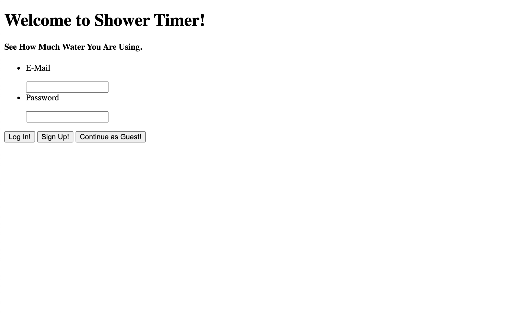
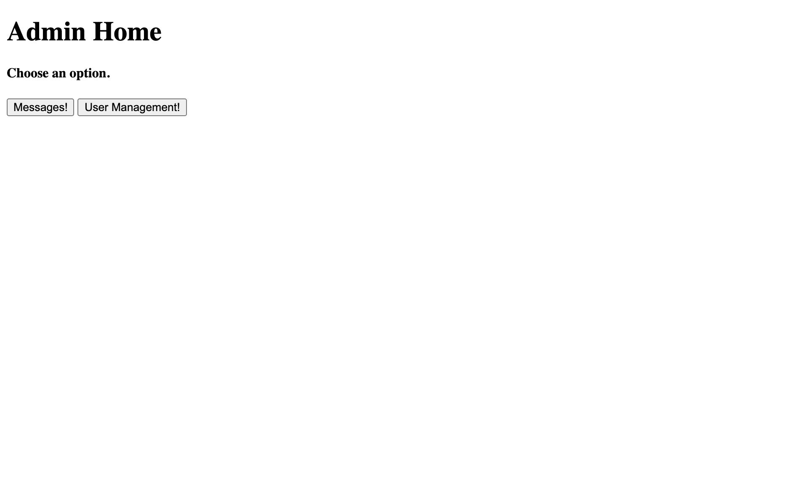

# Sprint-02 Report

## Team Number 01

Pradhyum Patel - OS & IT Infrastructure

Ryan Crawford - UI/UX Design

Gregory Prawdzik - Developer

Julie Gelman - Project Manager

## UI/UX Report

The goal this sprint for UI/UX was to add in a couple users to the database for reference when we began testing the website. We needed one admin user, and one standard user. Also, this sprint we would have update user stories. However, there was a plethora of technical difficulties related to Packer and Vagrant scripts that caused a major set back on this end. The issues have now been fixed and should be good for moving forward.

## Developer Report

During this sprint we were supposed to build a working login page. Unfortunatley, building our virtual machines proved to be more than we could handle and took us nearly the entire sprint to get all 4 of our VM's up and working. We tried to use Google One Tap Login for React. We coded the App.js with the appropriate key from Google to provide a login service from Google. Unfortunately, our test machine would not pull from GitHub. We destroyed that file on the VM and recloned the GitHub repository. This proved to be futile as the code did not work.  Our port we were listneing on was changed and the JSX files were not working. We tried to remedy this, but were unsuccessful.  

## IT Infrastructure Report

The goal for this sprint was to create a vagrant build that has automated deployment with database. However, our entire team had trouble simply building the vagrant box. We all did manage to successfully troubleshoot and build the box. The requirement for this sprint is setup accounts for all users (admin/guest) and manage their information across a database. Since our entire sprint time was used in troubleshooting, we should soon be able to get the database connected with the application and have accounts for all users. 

## Developer and Security Assumptions

This sprint, the goal was to automate a firewall to protect our applicaiton and database. We would also establish a the least amount of privlages needed per user. For example, admin would have full privilages to the application, a user would have just enough to log in, and track their information, and an anonymous user would only be able to use the timer. However, much like UI/UX we encountered technical difficulties that we had work through over the sprint as a group. Those issues have now been corrected, and should be good for moving forward. 

## User/Admin/Anonymous Story Goes here

Story 1: Admin sign in (skeleton)

Skeleton sign in page

Skeleton Admin home page

Story 2: Regular user sign in (skeleton)

Skeleton sign in page

Skeleton User home page

## Project Manager Report

Leading up to our second sprint, we encountered a few issues. Even though we were given extra time to complete our tasks, we all had problems setting up and accessing our VM. After a lot of troubleshooting and help from each other, Professor Hajek, and our TA, we were all able to get the VM up and running. However, we then ran into trouble when trying to buikd the login page and implement an authentication method. Though we all did our best to help this week's developer, we were just not able to build it successfully in time. This also hindered us from being able to develop infrastructure and security aspects and constraints, though we do have an outline of our development plan. This being said, going forward we intend to set more detailed goals, intermittent throughout the sprint period, so that we are able to find and fix bugs early and save time in the end. Overall at this point, I would say that our group is about 40% completed in our sprint 02 work, and roughly 15% completed of the entire project.
