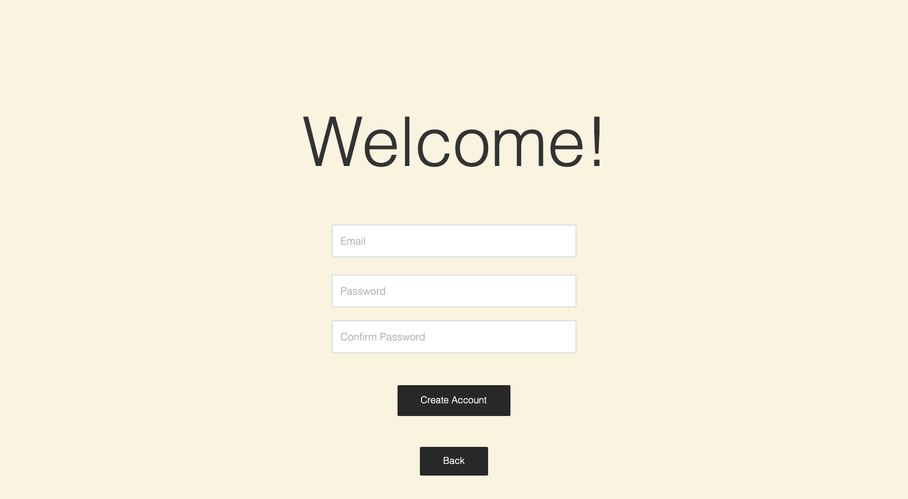
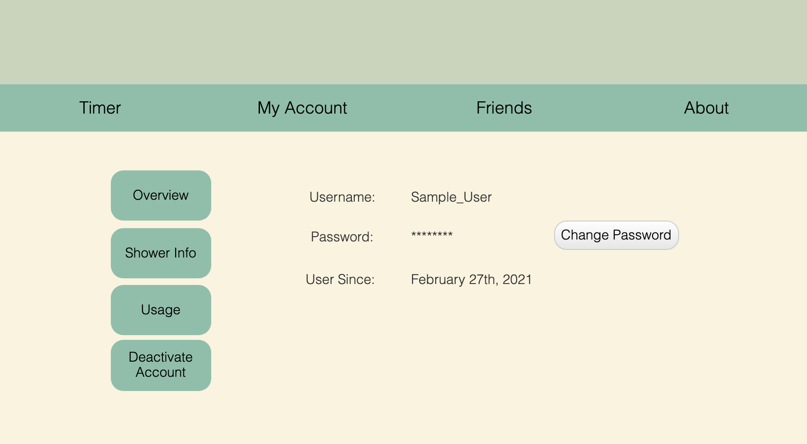
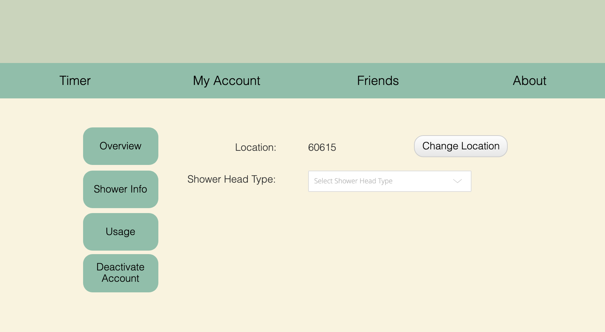
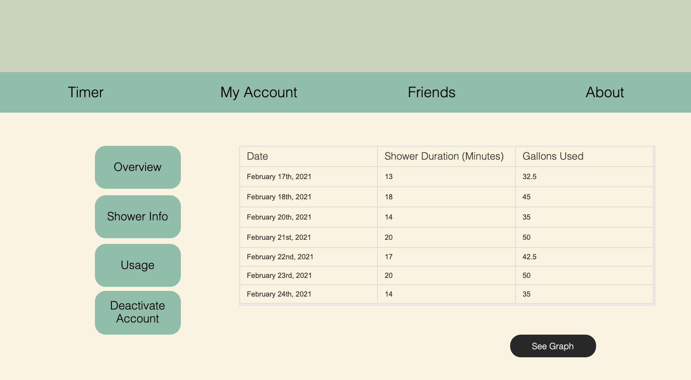
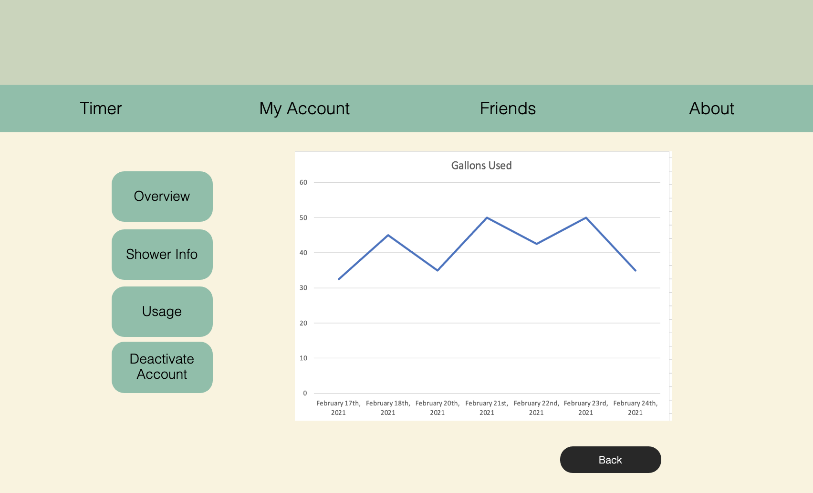

# Sprint-03 Written Report

## Team Number XX


* Pradhyum Patel - Developer 

* Ryan Crawford - OS & IT Infrastructure 

* Gregory Pradzik - Project Manager

* Julie Gelman - UI/UX Design & Jr. Developer


### UI/UX Artifacts

Place links and or screenshots to minimum of **4** artifacts here. Artifacts are defined as GitHub commit URL and Project Management Tool Kanban board images (Trello or JIRA).

User stories needs to be included in the *diagrams* folder but **not** included in the report section under UI/UX

Artifact 1: Kanban.


### Infrastructure

Place links and or screenshots to minimum of **5** artifacts here. Artifacts are defined as GitHub commit URL and Project Management Tool Kanban board images (Trello or JIRA).


Artifact 1: Frontend and Backend broken into 2 systems.


### Developer

Place links and or screenshots to minimum of **5** artifacts here. Artifacts are defined as GitHub commit URL and Project Management Tool Kanban board images (Trello or JIRA).

### Junior Developer

Place links and or screenshots to minimum of **4** artifacts here.  Artifacts are defined as GitHub commit URL and Project Management Tool Kanban board images (Trello or JIRA).

Place screen shot to image of a minimum of 5 GitHub issues/bugs reported and assigned

### Project Manager

1. Place images of the full User & Admin and/or anonymous story here with annotations of the functioning and the non-functioning portions as necessary (can reuse the artifact created by UI/UX)

* Our Login-Signup page is up, but users cannot currently login.
  * Login


* Our Timer nor Admin Home are not currently up.
  * Timer

  * Admin


* Other parts such as views of customer accounts are not currently available.
  * Overview 

  * Shower Info

  * Usage

  * Graph



2. Include a file  ```install.md``` in the root of the team GitHub Repo detailing all instructions to build and run the functioning parts of your site

[install.md](https://github.com/illinoistech-itm/2021-team01t/blob/main/sprint-03/install.md)


3. Verify that all defined minimum goals were met and explain goals that were reached beyond what was defined.  Also explain reasons behind goals that were not met.


[Shower Timer ERD](https://lucid.app/lucidchart/invitations/accept/4fe05fa7-d71d-42b2-af80-c3fc74869145?viewport_loc=403%2C-144%2C930%2C1020%2C0_0)

4. List any detailed assumptions your team made explaining deliverable context as needed
