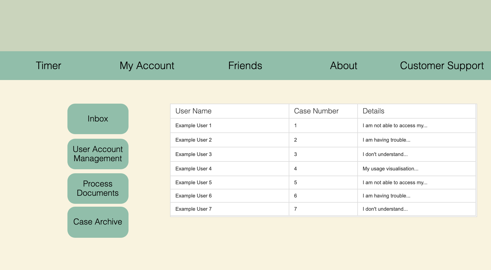

# Sprint-03 Written Report

## Team Number XX


* Pradhyum Patel - Developer 

* Ryan Crawford - OS & IT Infrastructure

* Gregory Pradzik - Project Manager

* Julie Gelman - UI/UX Design & Jr. Developer


### UI/UX Artifacts

Place links and or screenshots to minimum of **4** artifacts here. Artifacts are defined as GitHub commit URL and Project Management Tool Kanban board images (Trello or JIRA).

User stories needs to be included in the *diagrams* folder but **not** included in the report section under UI/UX

Artifact 1: Kanban.


### Infrastructure

Place links and or screenshots to minimum of **5** artifacts here. Artifacts are defined as GitHub commit URL and Project Management Tool Kanban board images (Trello or JIRA).


Artifact 1: Frontend and Backend broken into 2 systems.


Artifact 2: Trello Screenshot of task


Artifact 3: Trello Screenshot of task


Artifact 4: Commit url for adding to Diagrams
[commit url 1](https://github.com/rccrawford/2021-team01t/commit/af59de2a61c4e015d9ffe0a8e32236037106ff35)

Artifact 5: Commit url for adding ERD image and note
[commit url 2](https://github.com/rccrawford/2021-team01t/commit/5e67265d11b87a8a5e21d172ffa0a1f813b8f918)

### Developer

Place links and or screenshots to minimum of **5** artifacts here. Artifacts are defined as GitHub commit URL and Project Management Tool Kanban board images (Trello or JIRA).


### Junior Developer

Place links and or screenshots to minimum of **4** artifacts here.  Artifacts are defined as GitHub commit URL and Project Management Tool Kanban board images (Trello or JIRA).

This sprint saw some more problems for our team, specifically with myself and Pradhyum as developers. We were having trouble understanding the sample code we were given and how to test individual components. I ended up having to build and rebuild my boxes multiple times to see if my changes were effective, though it appeared the code never behaved the way I intended. Also, when compiling and running code, we experienced errors which we were not sure how to proceed with, as we did not think there would be an error to begin with. 

Error: when trying to view the database and tables automatically populated by the sample code, the DB was not able to be found.


Error: We wanted to test each SQL script individually to avoid rebuilding the boxes each time, but were not able to run the scripts in MariaDB.


Our code which was to create two tables for our database. One table would store user info and identify each user as an admin or regular user, and the other would store users' shower info. The primary key would be each users' user ID, which would be distinct and uniquely identifiable, and used to display water usage info over time for each user.


Kanban Artifacts: As Jr Developer, I had three major tasks this sprint. The following two were accomplished, with help from my other group members, though not without our fair share of errors.


The final task I had was to create root and non root users in the database. However, since we were not able to successfully create a database, this was not accomplished.


### Project Manager

1. Place images of the full User & Admin and/or anonymous story here with annotations of the functioning and the non-functioning portions as necessary (can reuse the artifact created by UI/UX)

* Our Login-Signup page is up, but users cannot currently login.
  * Login


* Our Timer nor Admin Home are not currently up.
  * Timer

  * Admin



* Other parts such as views of customer accounts are not currently available.
  * Overview 

  * Shower Info

  * Usage

  * Graph


2. Include a file  ```install.md``` in the root of the team GitHub Repo detailing all instructions to build and run the functioning parts of your site

[install.md](https://github.com/illinoistech-itm/2021-team01t/blob/main/sprint-03/install.md)


3. Verify that all defined minimum goals were met and explain goals that were reached beyond what was defined.  Also explain reasons behind goals that were not met.

* At the end of sprint 02, we had finally gotten our team to all build our boxes successfully, but were unable to get the login page to work.  
* Architecture was broken up into a frontend and backend.
* install.md added with instructions on how to use.
* Login/Registration currently non-functional.
  * We were plagued by our team having trouble successfully building the the front and backe end seperately. Once we had a good working build, that build was placed in the team repo.  All users will now fork from that repo and will now be our single source of truth.  We are still attempting to get this to work. Sadly, fixing this issue cost us time on building our login/registation pages.
* UI/UX is following user story closely.  Very little style has been added as we are still focused on functionality.  
* Firewall has been setup to only allow the frontend to communicate with the backend.
* Database has been setup and prepopulated with 1 admin and 1 general user. 
* [Shower Timer ERD](https://github.com/illinoistech-itm/2021-team01t/blob/1b1b49f2d7593294fb38689d5be0721776b080bf/sprint-03/diagrams/images/ShowerTimerERD(1).png)

4. List any detailed assumptions your team made explaining deliverable context as needed
* We were all trying to build on our own clones and did not properly fork the team repo.  After remediated this issue, all memebers now have a good clean base build to work off of and a single source of truth for the team.  

