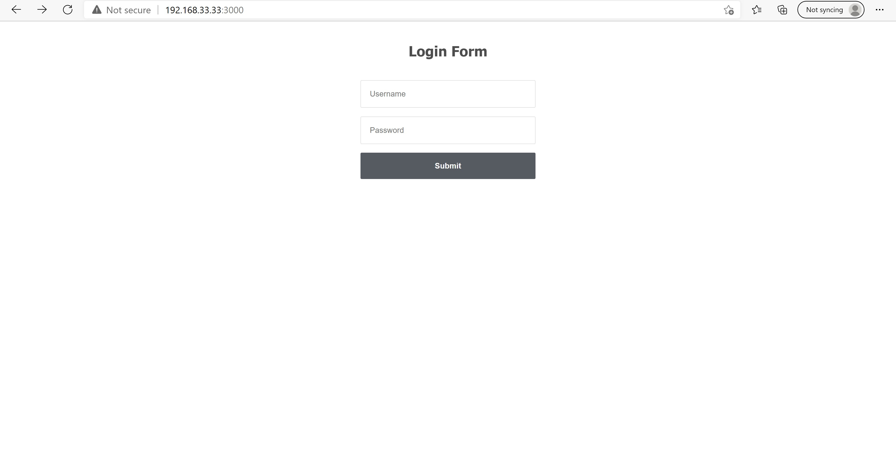

# Sprint-04 Written Report

## Team Number  2021-team01t

* Pradhyum Patel - Project Manager

* Ryan Crawford - Developer 

* Gregory Pradzik - UI/UX Design & Jr. Developer

* Julie Gelman - OS & IT Infrastructure

### UI/UX Design & Jr. Developer
We came into this sprint without an automated database.  We were able to get the database up, but it had to be done manually each time we built.  We were able to finally get the .sql scripts to work properly.  This allowed us to create a prepopulated database during our packer build.  The database consisted of two tables, users and shower times.  It was prepopulated with 2 users and 2 admins. The UI has not been updated as we are still trying to get the Login page to work.   

### Developer
We started sprint four with partially functional boxes. We had an issue of getting our front end to connect with our backend. While fixing that was in the works, we also started the process of creating css style sheets so when our database connection is successful, we will have pages ready to go.

In-progress examples 

Artifact:

### OS & IT Infrastructure

### Project Manager

The Deliverable for this sprint was to include a install.md with instructions on how to build and run your application. We are still in the building and troubleshooting phase where we just got done with the login page connection with the database. From this point onwards, everything should be done with ease as this was the hardest part. commit
